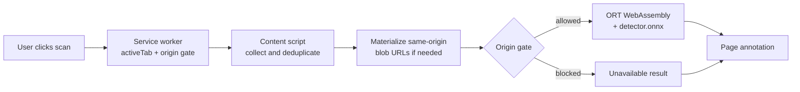
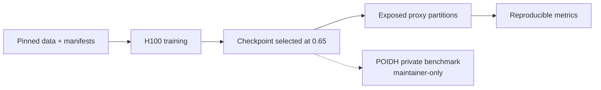

# POIDH local image detector

An inspectable Manifest V3 Chrome extension that scores page images on the
device. The extension ships its ONNX model and ONNX Runtime Web WASM files;
there is no inference server, cloud API, telemetry, or model download after
installation.

> Status: the local extension and contract tests are runnable. The H100 path is
> reproducible when its pinned data and environment are available. The proxy
> metrics below come from exposed partitions. POIDH's private benchmark is not
> included, so this is not a claim of bounty verification.

## What the repository promises

| Contract | Implementation |
| --- | --- |
| Browser surface | Native Chrome Manifest V3; scan starts from an explicit action |
| Inference | ONNX Runtime Web with a bundled WebAssembly backend |
| Model bundle | One 83 MiB ONNX file, no external tensor data, below the 100 MiB limit |
| I/O | `image` `[1, 3, 384, 384]` → `probability_ai` `[1, 1]` |
| Decision rule | Balanced accuracy reported at the fixed `0.65` threshold |
| Privacy boundary | Page image bytes come from the page origin or inline data URLs; inference stays local |
| Reproducibility | Pinned model source, digests, manifests, environment records, and tests |
| License | Original source is MIT; bundled model/runtime terms are listed in [NOTICE.md](NOTICE.md) |

## Runtime path



The extension uses `activeTab` and `scripting` only. It does not request
persistent host access. Cross-origin image URLs are reported as unavailable;
the extension never fetches them with privileged cross-origin access. See
[extension/README.md](extension/README.md) for runtime limits and failure
behavior.

## H100 proxy evidence

The numbers below describe the separate MONET research path, not the bundled
Community Forensics-derived browser model. Its selected checkpoint came from
H100 job `61725568`: 30 epochs with fixed-threshold balanced-accuracy
selection. The checkpoint SHA-256 is
`cf176ce6279d51514292c725fcdb49c6f26a3cf2ce91a1c05970601ce50216d4`.
Job `61725671` evaluated that checkpoint on two frozen public proxy partitions.

| Split | Samples | Balanced accuracy @ 0.65 | AUC |
| --- | ---: | ---: | ---: |
| Calibration partition | 29,886 | **77.65%** | 0.8975 |
| Validation partition | 29,886 | **77.36%** | 0.8965 |
| Bounty gate | — | 75.00% | — |

```text
# exposed proxy partitions only
Calibration  ███████████████▌  77.65%
Validation   ███████████████▍  77.36%
Bounty gate  ███████████████   75.00%
```

These are useful regression signals, not the maintainer's private score. The
evaluation boundary is deliberately kept separate:



## Run the checks

The core package needs Python 3.11 or newer. The extension tests use Node's
built-in test runner.

```bash
python3 -m venv .venv
source .venv/bin/activate
python -m pip install -e '.[dev]'

python -m unittest discover -s tests -v
node --experimental-vm-modules --test extension/tests/*.mjs extension/tests/*.cjs
ruff check .
```

To inspect the extension, open `chrome://extensions`, enable Developer mode,
choose **Load unpacked**, and select [`extension/`](extension/).

## Rebuild the bundled model

The bundled graph is a deterministic wrapper around the MIT-licensed public
Community Forensics export. The wrapper renames the tensors and embeds the
`+2.29` logit calibration offset plus sigmoid.

```bash
git clone https://github.com/pixilated730/local-ai-image-detector.git /tmp/local-ai-image-detector
git -C /tmp/local-ai-image-detector checkout --detach dddb57b
python3 -m pip install 'onnx==1.20.1' numpy
python3 tools/wrap_community_forensics_onnx.py \
  /tmp/local-ai-image-detector/extension/models/detector.onnx \
  --destination extension/model/detector.onnx
sha256sum extension/model/detector.onnx
```

Expected model digest:

```text
89be5ba0b80dfa2e2fa6bbc3eea28562a07a067905d8407f8540ebfa13a565ba
```

The input, output, preprocessing, and size policy are recorded in
[`extension/model/metadata.json`](extension/model/metadata.json).

## Training and provenance

The optional MONET path prepares deterministic manifests, checks declared
licenses, prevents overlap with registered holdouts, and records hashes for
the data, code, configuration, environment, and checkpoint. H100 submission,
resume, and monitoring commands are in [hpc/README.md](hpc/README.md).

This repository does not redistribute the MONET images or training
checkpoints. Review [NOTICE.md](NOTICE.md) before using upstream data,
generated images, model weights, or optional dependencies.

## License

Original source code is released under the [MIT License](LICENSE). Third-party
software and dataset notices are listed in [NOTICE.md](NOTICE.md).
