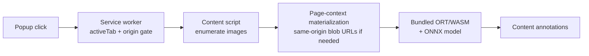

# MV3 local detector extension

This directory is the browser-facing part of the project. It finds ordinary
`` elements after the user clicks **Scan images on this page**, then adds a
confidence score or a clear unavailable/error state next to each image.

## How a scan works

Inference never leaves the browser. ONNX Runtime Web and the model are
vendored under `runtime/vendor/` and `model/`; no runtime or model download,
telemetry, or result upload occurs after installation. The extension asks only
for `activeTab` and `scripting`, so it has no persistent `host_permissions` and
no runtime permission prompt.

Network image bytes are fetched only from the scanned page's origin. Inline
`data:image/*` sources are accepted, and same-origin blob URLs are materialized
in the page context. Cross-origin HTTP and blob URLs remain unavailable rather
than being fetched with privileged extension access.

## Model contract

The service worker verifies the model SHA-256 and metadata before creating a
session, then checks the session's ONNX I/O contract. The bundled graph accepts
`float32` NCHW input
`[1, 3, 384, 384]` named `image` and returns calibrated probability
`[1, 1]` named `probability_ai`.

Preprocessing uses the fixed 440px resize and 384px center-crop contract
recorded in `model/metadata.json`, then converts RGBA to RGB NCHW and applies
ImageNet normalization. Each image is bounded by these runtime limits:

| Limit | Value |
| --- | ---: |
| Encoded bytes | 20 MiB |
| Pixels | 16 megapixels |
| Width or height | 8,192 px |
| Fetch/decode time | 30 seconds |

A failed or timed-out image becomes a terminal unavailable result; processing
continues with the next image.

## Load it locally

1. Open `chrome://extensions`.
2. Enable **Developer mode**.
3. Choose **Load unpacked**.
4. Select this `extension` directory.

The root [README](../README.md) documents model rebuilding, tests, H100
provenance, and third-party licensing. See [NOTICE.md](../NOTICE.md) before
redistributing the bundled runtime or detector weights.
